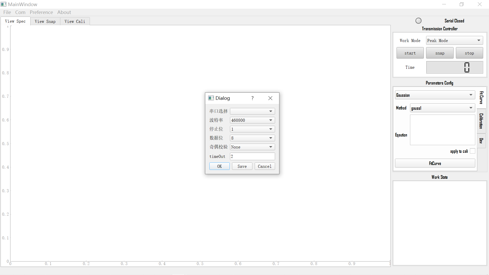
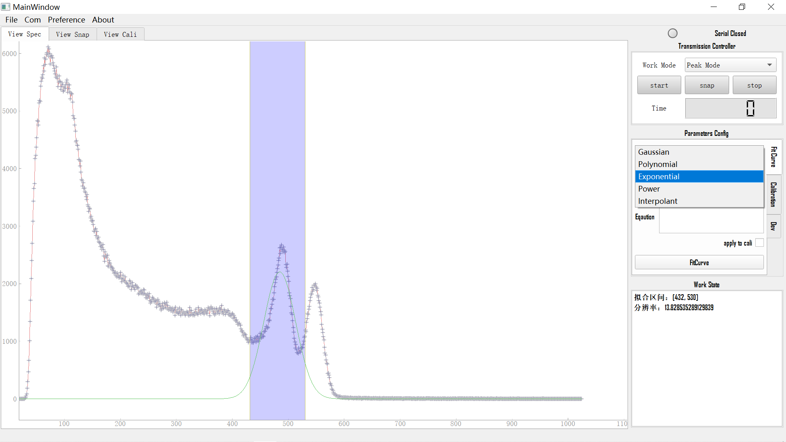
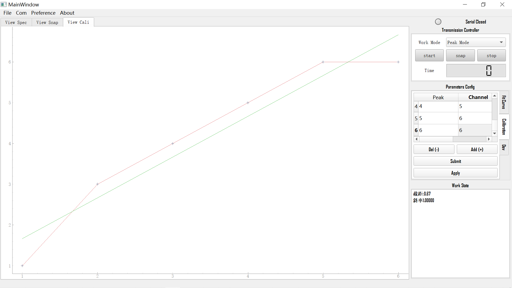

## **能谱绘制工具**

### **一、功能简介：**

1、通过串口与arm版相连实现数据的通信，读取arm数据采集版发送的实时能谱数据/信号峰值采样数据，实时绘制能谱图和在线数据分析、数据导出。

2、本地能谱数据读取（csv/txt），对本地数据进行图形化显示和数据处理、数据的导出。

### **二、界面展示：**

**串口配置**

    

**能谱高斯拟合**

    

**能谱能量刻度界面**

    

### **三、通信格式**

支持两种能谱数据的解析：

1、峰值模式：连续发送信号峰值，上位机对峰值信号手动hist成谱

**数据包：**<u>00 00 00 00</u> FF <u>00 00 00 01</u> FF ... ... <u>00 00 00 01</u> FF

每个数据包为5个字节组成，每四个字节（下划线）组成一个能量点（移位拼接成32位整数），包尾FF可在软件中修改

2、直接模式：直接串口发送完整能谱

**数据包：**<u>00 00 00 00</u> <u>00 00 00 01</u> ... ... <u>00 00 00 01</u> FF

一次发送的数据包为一张完整的能谱图（y轴数据），每4个字节组成一道，能谱道数可以软件修改。
